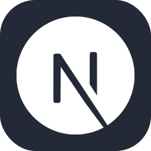

This is a [Next.js](https://nextjs.org/) project bootstrapped with [`create-next-app`](https://github.com/vercel/next.js/tree/canary/packages/create-next-app).

<!-- ABOUT THE PROJECT -->

## About The Project

✅ پروژه خرید و فروش املاک ✅

شما وارد حساب کاربری خودتون می شوید

می تونین ملک هایی که توسط دیگران به فروش گذاشته شده رو مشاهده کنید

و یا خودتون اگر ملکی برای فروش دارید به آن اضافه کنید

- [Demo Project](https://boto-amlak.liara.run/)

deploy in liara.ir

## Technologies Used

 1. NextAuth
 2. Connection to DB
 3. mongoose
 4. react-hot-toast
 5. axios
 6. bcryptjs
 7. react-copy-to-clipboard
 8. react-icons
 9. react-loader-spinner
 10. react-multi-date-picker

### Built With

| `nextjs` |  |

## Running locally in development mode

To get started, just clone the repository and run `npm install && npm run dev`:

    git clone https://github.com/Erfanabi/fullstack-amlak.git
    npm install
    npm run dev

## Building and deploying in production

If you wanted to run this site in production, you should install modules then build the site with `npm run build` and run it with `npm start`:

    npm install
    npm run build
    npm start

You should run `npm run build` again any time you make changes to the site.

Note: If you are already running a webserver on port 80 (e.g. Macs usually have the Apache webserver running on port 80) you can still start the example in production mode by passing a different port as an Environment Variable when starting (e.g. `PORT=3000 npm start`).

<!-- CONTACT -->

## Contact

Erfan Sharafi - [09105003119] - erfansharafi60@gmail.com

Project Link: [https://github.com/Erfanabi/fullstack-amlak](https://github.com/Erfanabi/fullstack-amlak)

<!-- MARKDOWN LINKS & IMAGES -->
<!-- https://www.markdownguide.org/basic-syntax/#reference-style-links -->